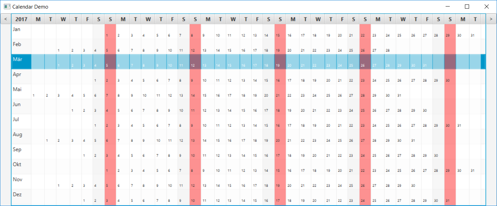

# fxcalendar
Calendar implemented in JavaFX

A calendar view showing one complete year in landscape format in a table, with one row for each month.

## Extend
By overwriting the class CalendarYearViewFactory the calendar can be changed.
* The method createCellValueFactory can be overwritten to return a different implementation of DefaultDateInformationFactory.
* The method createTableCellForWeekDay can be overwritten to return a different implementation of TableCell.
